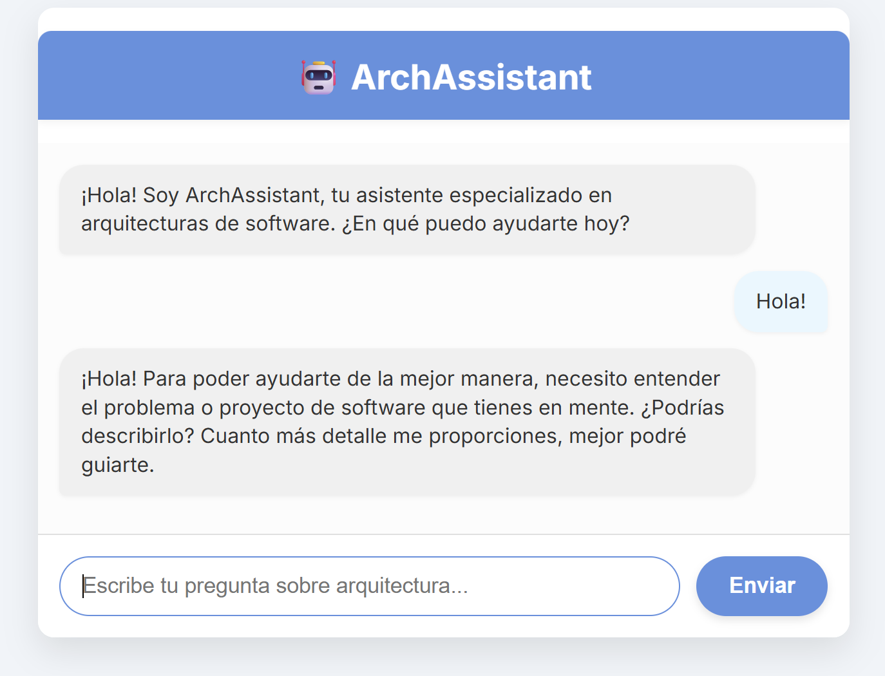
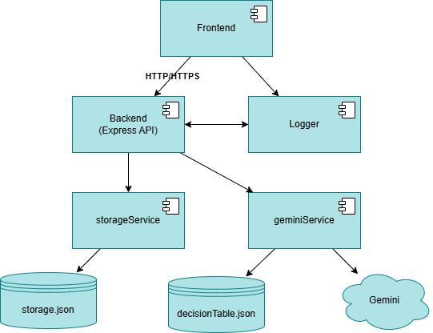
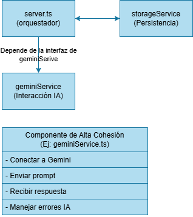

# 🤖 ArchAssistant

ArchAssistant is an intelligent assistant developed for a Software Architecture course in a Master's in Computer Engineering program. It leverages the Google Gemini API to serve as an expert software architect, guiding users through a simple chat interface.

The primary goal of this assistant is to "interview" a user to understand the requirements of their software project. Through a guided conversation, it asks key questions about quality attributes and constraints. Based on the user's answers, it recommends a suitable software architecture (e.g., Microservices, Monolithic, Event-Driven) and suggests relevant technologies.

## 🚀 How It Works

The assistant's logic is not just a generic chatbot. It's guided by a detailed system prompt (`src/services/geminiService.ts`) that is dynamically built using a "decision matrix" from `decisionTable.json`.

1.  **Decision-Driven Interview**: The assistant's prompt instructs it to ask targeted questions to gather information on 6 key **Decision Parameters**.
2.  **Weighted Parameters:** Each parameter has a "weight" to define its importance:
    - Scalability (Weight: 3)
    - Team Experience (Weight: 2)
    - Infrastructure Cost (Weight: 2)
    - Latency & Performance (Weight: 3)
    - Security (Weight: 2)
    - Maintainability (Weight: 3)
3.  **Architecture Scoring:** The **decisionTable.json** also provides scores for five different architectures (Monolithic, Microservices, SOA, Event-Driven, Layered) against each parameter.
4.  **Contextual Recommendation:** TThe AI combines the user's answers from the "interview" with this scoring table (which is part of its prompt) to provide a final, justified recommendation that best fits the user's described project needs.

## 📸 Features & Architecture

**User Interface**
The project features a clean, responsive chat interface for interacting with the assistant.



**System Architecture**
The application follows a simple, layered architecture with a clear separation of concerns.



**Design Principles**
The backend code is structured around principles of **High Cohesion** (each service has one job, like `storageService` or `geminiService`) and Low Coupling (the main `server.ts` orchestrates these services, which don't depend on each other directly).



## 🛠️ Tech Stack

- **Backend:** Node.js, Express, TypeScript
- **Frontend:** HTML, CSS, JavaScript (using `marked.js` to render Markdown)
- **IA:** Google Gemini (via `node-fetch`)
- **Session Management:** Uses browser cookies for `sessionId` tracking
- **Data Persistence:** A simple `storage.json` file on the server to store chat history by `sessionId`

## 🚀 Getting Started

To run this project locally, you will need [Node.js](https://nodejs.org/) and npm.

1.  **Clone the repository:**

    ```bash
    git clone [https://github.com/nrivas2017/archssistant.git](https://github.com/nrivas2017/archssistant.git)
    cd archssistant
    ```

2.  **Install dependencies:**

    ```bash
    npm install
    ```

3.  **Create your Environment File (`.env`)** Create a file named `.env` in the root of the project. It is ignored by git. Add your Google Gemini API key here.

    **Contenido del `.env`:**

    ```env
    # Server configuration
    SERVER="localhost"
    PORT="3000"

    # Google Gemini API Key (Required)
    # Get yours from Google AI Studio
    AI_KEY_RIVAS="YOUR_API_KEY_HERE"

    # Gemini API Endpoint
    AI_URL_RIVAS="https://generativelanguage.googleapis.com/v1beta/models/gemini-2.0-flash:generateContent"
    ```

4.  **Build the TypeScript code:** This will compile all TypeScript files from `src/` into JavaScript in the `dist/` directory.

    ```bash
    npm run build
    ```

5.  **Start the server:** This runs the compiled application.

    ```bash
    npm start
    ```

6.  **Open the application:** Navigate to `http://localhost:3000` in your web browser.

## 📜 Available Scripts

- `npm run build`: Compiles the TypeScript project.
- `npm start`: Runs the production server (from `dist/`).
- `npm run dev`: Runs the server in development mode using `ts-node-dev` for auto-reloading.

## 📁 Project Structure

```bash
/archssistant
├── /img                # Diagrams and screenshots
│   ├── componentes.png
│   ├── principios-arquitectonicos.png
│   └── ui.png
├── /public             # Frontend static files
│   ├── index.html
│   ├── script.js
│   └── style.css
├── /src                # Backend TypeScript source
│   ├── /middlewares    # Express middlewares
│   │   └── requestLogger.ts
│   ├── /services       # Business logic
│   │   ├── geminiService.ts  (Gemini API & prompt logic)
│   │   └── storageService.ts (Handles storage.json)
│   ├── /types          # TypeScript type definitions
│   │   ├── chat.d.ts
│   │   └── gemini.d.ts
│   └── server.ts       # Express server entry point
├── .env                # (Local environment variables)
├── .gitignore
├── decisionTable.json  # Core decision matrix for the AI
├── package.json
├── storage.json        # (Chat history data)
└── tsconfig.json
```
